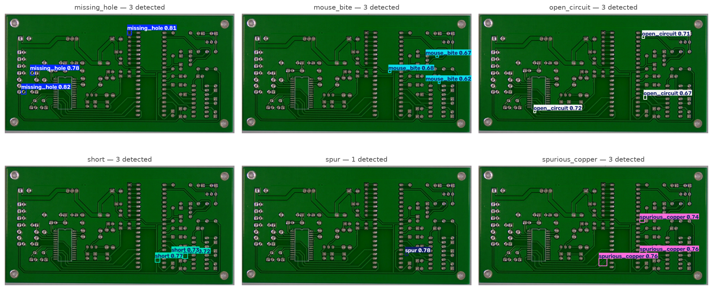
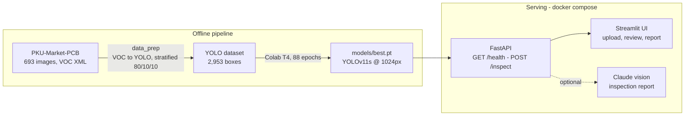
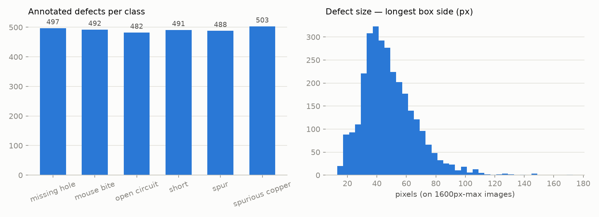

# PCB Defect Detection

**YOLOv11 defect detection for bare printed circuit boards, with AI-written inspection reports — served via FastAPI + Streamlit, fully dockerized.**




A fine-tuned **YOLOv11s** finds six classes of PCB manufacturing defects — `missing_hole`, `mouse_bite`, `open_circuit`, `short`, `spur`, `spurious_copper` — and **Claude vision** turns the detections into a structured inspection report (severity, location, likely cause, recommended rework), the way an AOI station hands findings to a rework technician.

## Results

Held-out test split (66 images, never seen in training), `imgsz=1024`:

| Metric | Value |
|---|---|
| **mAP@50** | **0.9565** |
| mAP@50-95 | 0.5239 |
| Precision | 0.9513 |
| Recall | 0.9347 |

| Class | Precision | Recall | mAP@50 |
|---|---|---|---|
| missing_hole | 0.9634 | 1.0000 | 0.9773 |
| mouse_bite | 0.9247 | 0.9954 | 0.9743 |
| open_circuit | 0.9671 | 0.9762 | 0.9921 |
| short | 0.9294 | 1.0000 | 0.9775 |
| spur | 1.0000 | 0.7756 | 0.9018 |
| spurious_copper | 0.9234 | 0.8613 | 0.9157 |

Inference: **~148 ms/image** on Apple M4 (MPS), ~880 ms on CPU inside Docker — identical detections on both. Full details, confusion matrix and per-class analysis in [`reports/evaluation.md`](reports/evaluation.md).

## Architecture



Design choices worth noting:

- **1024 px training/inference size** — the median defect is only ~45 px on ~3000 px source images; at YOLO's default 640 px, defects shrink below reliable detection size.
- **Reports are enrichment, never a dependency** — if the Anthropic API is unreachable or out of credits, `/inspect` still returns HTTP 200 with detections and a `report_error` message instead of failing.
- **One Docker image, two services** — the same CPU-only PyTorch image runs the API (default CMD) and the UI (compose command override); the UI waits on the API health check.

## Quickstart

```bash
git clone https://github.com/Viraj5503/PCB-Defect-Detection.git
cd PCB-Defect-Detection
```

**1. Get the model weights** (pick one):

```bash
# a) download the trained weights from the release (recommended)
mkdir -p models
curl -L -o models/best.pt \
  https://github.com/Viraj5503/PCB-Defect-Detection/releases/download/v1.0.0/best.pt

# b) or train them yourself: prepare the dataset (below), run
#    scripts/make_dataset_zip.py, then open notebooks/train_colab.ipynb
#    in Google Colab (free T4) and press Run-all.
```

**2. Run with Docker** (nothing else to install):

```bash
docker compose up --build
```

- Streamlit UI → http://localhost:8501 (two sample boards are bundled — no dataset needed)
- API docs → http://localhost:8000/docs

**Optional — AI inspection reports:** copy `.env.example` to `.env` and set `ANTHROPIC_API_KEY`. Without it everything works except the report toggle.

### Local development (without Docker)

```bash
python3.11 -m venv .venv && source .venv/bin/activate
pip install -r requirements.txt && pip install -e .

uvicorn pcb_vision.api:app --port 8000      # terminal 1 — API
streamlit run app/streamlit_app.py           # terminal 2 — UI
pytest                                       # 20 tests, model & API mocked
```

### Rebuilding the dataset (only needed for training / evaluation)

```bash
git clone --depth 1 https://github.com/Ironbrotherstyle/PCB-DATASET.git data/raw/PCB_DATASET
python -m pcb_vision.data_prep    # VOC -> YOLO, stratified 80/10/10 split, seed 42
python -m pcb_vision.evaluate     # re-run test-split evaluation (needs models/best.pt)
```

## API

```bash
curl -s -X POST "http://localhost:8000/inspect?conf=0.25&with_report=false" \
  -F "image=@app/samples/01_missing_hole_04.jpg"
```

```jsonc
{
  "detections": [
    {"class_name": "missing_hole", "confidence": 0.82, "box_xyxy": [637.4, 861.3, 675.9, 900.9]}
  ],
  "annotated_image_b64": "...",   // JPEG with drawn boxes
  "report": null,                 // markdown inspection report when with_report=true
  "report_error": null,           // set instead of failing if report generation breaks
  "inference_ms": 148.2
}
```

`GET /health` → `{"status": "ok", "model_loaded": true}` — used as the compose health gate.

## Project structure

```
├── src/pcb_vision/
│   ├── data_prep.py        # VOC XML -> YOLO labels, stratified split
│   ├── eda.py              # dataset stats + figures
│   ├── evaluate.py         # test-split metrics, confusion matrix, gallery
│   ├── report.py           # Claude vision inspection reports
│   └── api.py              # FastAPI service
├── app/streamlit_app.py    # demo UI (+ bundled sample boards)
├── notebooks/train_colab.ipynb   # self-contained Colab training notebook
├── scripts/                # dataset zip builder, API smoke test
├── tests/                  # 20 pytest tests (TDD; YOLO & Claude mocked)
├── reports/                # evaluation.md, dataset_stats.md, figures/
├── Dockerfile + docker-compose.yml
└── models/best.pt          # not committed — see Quickstart step 1
```

## Dataset

[PKU-Market-PCB](https://robotics.pku.edu.cn/) (Open Lab on Human Robot Interaction, Peking University): 693 high-res images of bare PCBs, 2,953 annotated defects across 6 classes, roughly balanced (115–116 images per class). Downloaded from the [community mirror](https://github.com/Ironbrotherstyle/PCB-DATASET) since the official host is Baidu-only. Stats and EDA figures in [`reports/dataset_stats.md`](reports/dataset_stats.md).



## Example inspection report

See [`reports/sample_inspection_report.md`](reports/sample_inspection_report.md) — generated live by Claude from a test-split board with three missing-hole detections.

## Roadmap

- **Phase 2 — RAG over quality standards:** retrieve the relevant acceptability criterion (IPC-A-610-style knowledge base) for each detected defect class and ground the repair recommendation in it.

## License

[MIT](LICENSE)
