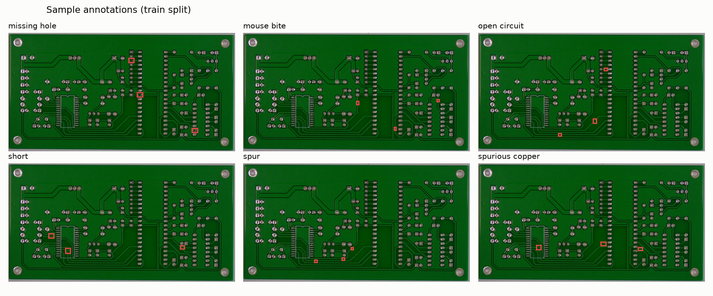

# Dataset statistics — PKU-Market-PCB (processed)

- **Images:** 693 (train 555 / val 72 / test 66, stratified 80/10/10, seed 42)
- **Annotated defects:** 2953
- **Median defect size:** 46px longest side (0.072% of image area) — small-object regime, motivating training at `imgsz=1024`
- Images downscaled to max side 1600px (labels are normalized; unaffected)
- The mirror's `rotation/` split ships without bounding boxes and is excluded; online augmentation (mosaic, flips, HSV) covers rotation invariance during training

| Class | Boxes |
|---|---|
| missing_hole | 497 |
| mouse_bite | 492 |
| open_circuit | 482 |
| short | 491 |
| spur | 488 |
| spurious_copper | 503 |

