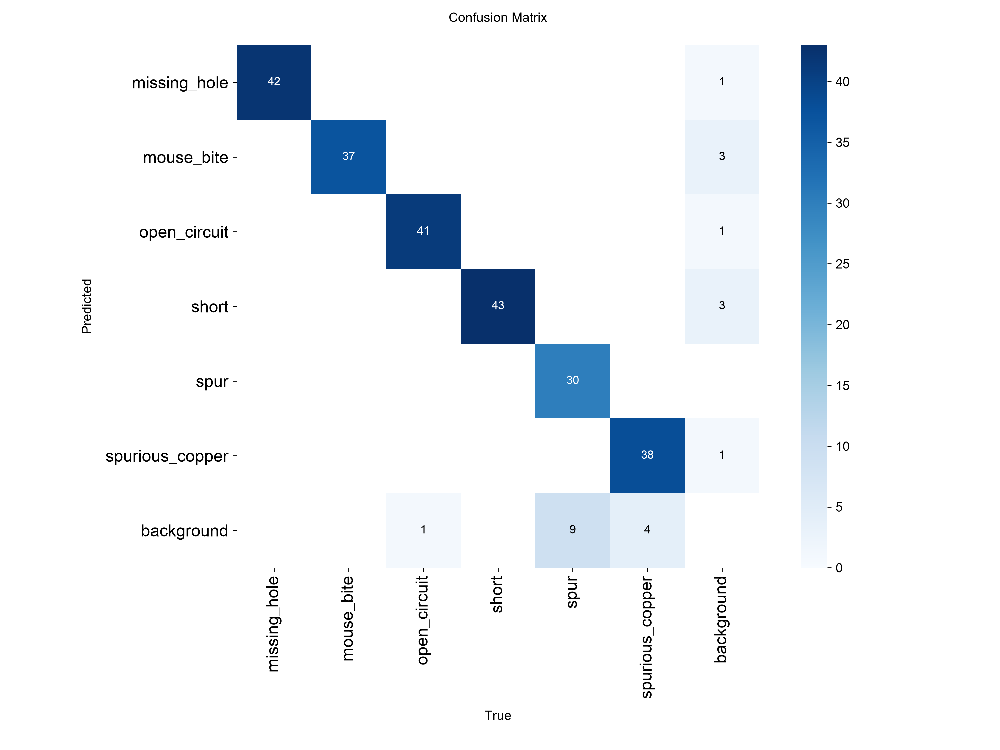

# Model Evaluation — YOLOv11s on PKU-Market-PCB

Held-out **test split** (66 images), `imgsz=1024`, weights `models/best.pt`
(fine-tuned from `yolo11s.pt` on Colab T4, 88 epochs, early-stopped, seed 42).

## Overall

| Metric | Value |
|---|---|
| mAP50 | 0.9565 |
| mAP50-95 | 0.5239 |
| Precision | 0.9513 |
| Recall | 0.9347 |

## Per class

| Class | Precision | Recall | mAP50 | mAP50-95 |
|---|---|---|---|---|
| missing_hole | 0.9634 | 1.0000 | 0.9773 | 0.6117 |
| mouse_bite | 0.9247 | 0.9954 | 0.9743 | 0.5548 |
| open_circuit | 0.9671 | 0.9762 | 0.9921 | 0.5632 |
| short | 0.9294 | 1.0000 | 0.9775 | 0.4844 |
| spur | 1.0000 | 0.7756 | 0.9018 | 0.4570 |
| spurious_copper | 0.9234 | 0.8613 | 0.9157 | 0.4720 |

## Figures

